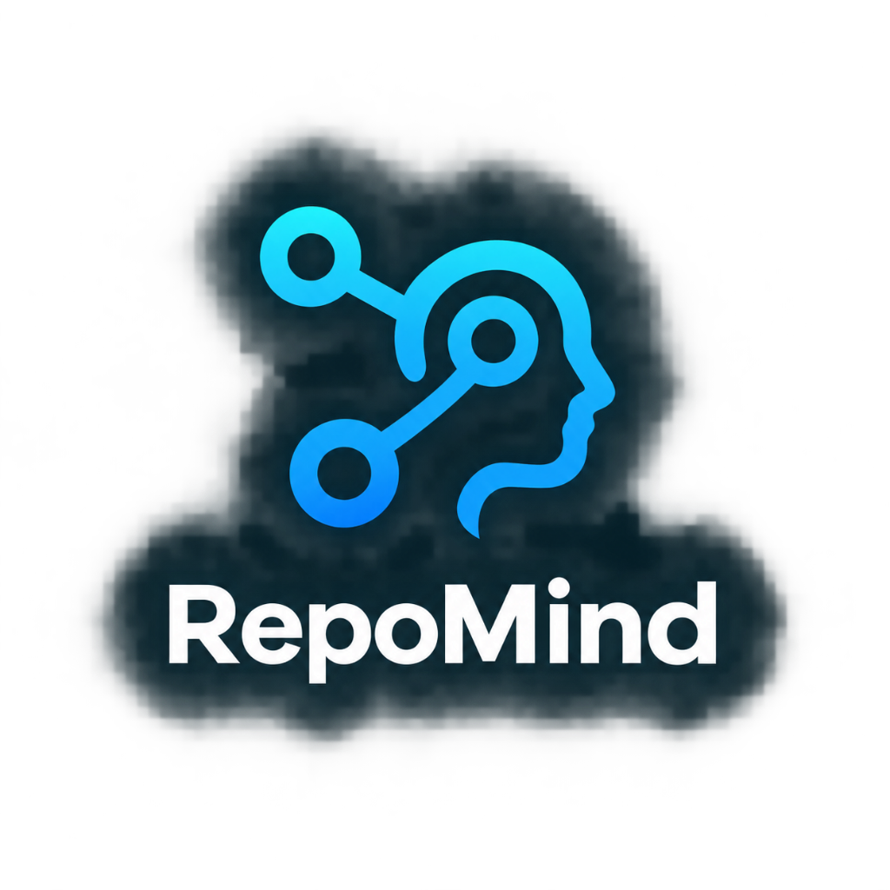

<p align="center">
  
</p>

# RepoMind

> **Agentic Codebase Intelligence & Autonomous RAG Platform**  
> *Understand complex software repositories through AI-driven search, interactive dependency graphs, evidence-grounded synthesis, and deep multi-step code investigation.*

---

## 🌟 Overview

**RepoMind** is a state-of-the-art developer platform designed to make exploring, understanding, and debugging large software codebases fast, intuitive, and evidence-grounded. 

By combining **LangGraph autonomous agents**, **Qdrant vector search**, **AST-aware symbol extraction**, **interactive node graphs**, and **locally-hosted LLMs**, RepoMind transforms raw repository trees into actionable structural intelligence.

---

## ✨ Key Features

| Feature | Description |
| :--- | :--- |
| 🔍 **Autonomous Code Chat** | Ask natural-language questions about your codebase. A LangGraph investigation agent plans tool calls, searches symbols, inspects files, and delivers answers backed by exact `file:line` citations. |
| 🕸️ **Interactive Code Graph** | Visualize module dependencies, import paths, and function callers in a dynamic 2D canvas with depth filtering, node inspection, and AI explanations. |
| 🏛️ **Architecture Overview** | Generate comprehensive, evidence-grounded architecture briefings detailing system components, entry points, data flows, boundaries, and uncertainties. |
| 🚀 **Deterministic Indexing** | Ingest Git URLs or local folders with `.gitignore` filtering, secret masking, tree-sitter/AST symbol parsing, deterministic chunking, and Qdrant vector storage. |
| 🔒 **Privacy & Security** | Runs on local Ollama models (`gemma4:31b-cloud`) or Groq. Sandboxed, read-only investigation tools prevent directory traversal or unsafe execution. |
| ⚡ **Resilient Modern Dashboard** | Sleek Next.js frontend with dark mode, responsive controls, AbortController request timeout protection, and actionable error/retry states. |

---

## 🏗️ System Architecture

```text
                                  +-----------------------+
                                  |   Next.js Frontend    |
                                  | (Dashboard/Graph/Chat)|
                                  +-----------+-----------+
                                              |
                                              | REST API / HTTP
                                              v
                                  +-----------------------+
                                  |   FastAPI Backend     |
                                  +-----------+-----------+
                                              |
      +-------------------+-------------------+-------------------+-------------------+
      |                   |                   |                   |                   |
      v                   v                   v                   v                   v
+-----------+       +-----------+       +-----------+       +-----------+       +-----------+
| Ingestion |       | LangGraph |       |  Qdrant   |       |   Local   |       | SQLite /  |
| Pipeline  |       |   Agent   |       | Vector DB |       |  Ollama   |       | PostgreSQL|
+-----------+       +-----------+       +-----------+       +-----------+       +-----------+
(Discover/Chunk)  (Plan/Tools/Eval)   (1024-dim Embeds)   (LLM Reasoning)   (Metadata/Store)
```

---

## 🔄 End-to-End Request Flow

```text
1. Register Repository   ──►  Post Git URL or local folder path.
2. Ingest & Index        ──►  Discover files -> Filter secrets/binaries -> Parse AST 
                               -> Chunk -> Embed (Mistral Embeddings) -> Upsert to Qdrant.
3. Query & Investigate   ──►  LangGraph Agent receives user question -> Classifies intent 
                               -> Executes read-only tool steps -> Evaluates evidence.
4. Grounded Response     ──►  Generates answer with verified file:line citations & execution trace.
```

---

## 🛠️ Technology Stack

### Frontend
- **Framework**: [Next.js 16](https://nextjs.org/) (App Router), [React 19](https://react.dev/)
- **Language**: TypeScript
- **Styling**: Tailwind CSS v4, Vanilla CSS tokens
- **Interactive Visualizations**: React Flow (Code Graph), Lucide Icons

### Backend
- **Framework**: [FastAPI](https://fastapi.tiangolo.com/), Pydantic v2, `pydantic-settings`
- **Agent Framework**: [LangChain](https://www.langchain.com/) / [LangGraph](https://www.langchain.com/langgraph)
- **Vector Database**: [Qdrant](https://qdrant.tech/) (`qdrant-client`)
- **Database ORM**: SQLAlchemy 2.0 (Async) with SQLite / PostgreSQL (Supabase) + Alembic
- **AI Models**:
  - **LLM Reasoning**: Local [Ollama](https://ollama.com/) (`gemma4:31b-cloud`) or [Groq](https://groq.com/) (`llama-3.3-70b-versatile`)
  - **Embeddings**: Mistral API (`mistral-embed`, 1024 dimensions)

---

## 🚀 Quick Start Guide

### Prerequisites
- **Python**: `3.11` or higher
- **Node.js**: `18.0` or higher (with `npm` or `pnpm`)
- **Ollama**: Installed and running locally (`http://localhost:11434`)
- **Mistral API Key**: For vector embeddings

---

### 1. Backend Setup

```bash
# Navigate to the backend directory
cd backend

# Create and activate a Python virtual environment
python -m venv .venv

# On Windows:
.venv\Scripts\activate

# On Linux/macOS:
source .venv/bin/activate

# Install dependencies
pip install -r requirements.txt

# Create environment configuration from example
copy .env.example .env   # On Windows
# cp .env.example .env   # On Linux/macOS
```

Edit `backend/.env` to configure your keys and ports:

```dotenv
APP_NAME=RepoMind
APP_ENV=development
DEBUG=true

# LLM & Embeddings Configuration
LLM_PROVIDER=ollama
OLLAMA_BASE_URL=http://localhost:11434
OLLAMA_MODEL=gemma4:31b-cloud
MISTRAL_API_KEY=your_mistral_api_key_here

# Vector Database (Qdrant)
QDRANT_URL=http://localhost:6333  # or Qdrant Cloud URL
QDRANT_COLLECTION_NAME=repomind

# Enable Features
DEPENDENCY_GRAPH=true
ARCHITECTURE_OVERVIEW=true
```

Initialize the database and start the FastAPI dev server:

```bash
# Initialize local SQLite database
python -m scripts.init_db

# Start FastAPI backend server on port 8001
python -m uvicorn app.main:app --port 8001 --reload
```

Verify backend health at: [http://127.0.0.1:8001/health](http://127.0.0.1:8001/health)

---

### 2. Frontend Setup

```bash
# Navigate to the frontend directory
cd frontend

# Install dependencies
npm install

# Create local environment file
echo NEXT_PUBLIC_API_URL=http://127.0.0.1:8001 > .env.local

# Start Next.js development server
npm run dev
```

> **Note**: `NEXT_PUBLIC_*` environment variables are baked into the client bundle at startup time. If you update `frontend/.env.local`, restart `npm run dev`.

Open [http://localhost:3000](http://localhost:3000) in your browser.

---

## 🔍 Investigation Tools Reference

The RepoMind investigation agent utilizes a suite of safe, read-only tools:

| Tool | Purpose |
| :--- | :--- |
| `search_code` | Bounded text and pattern search across ingested repository files. |
| `read_file` | Reads file content with precise line range bounds and citation headers. |
| `list_directory` | Explores repository directory trees with depth limits and ignore rules. |
| `get_symbol` | Parses Python/AST function and class definitions, signatures, and docstrings. |
| `find_references` | Locates word-boundary symbol usages and calls across the codebase. |
| `dependency_graph` | Extracts module import relationships to build dependency networks. |
| `git_log` / `git_blame` | Queries read-only Git commit history and line authorship safely. |

---

## ⚙️ Environment Configuration Matrix

| Variable | Default Value | Description |
| :--- | :--- | :--- |
| `LLM_PROVIDER` | `ollama` | Selected reasoning model provider (`ollama` or `groq`). |
| `OLLAMA_BASE_URL` | `http://localhost:11434` | Base URL for local Ollama server instance. |
| `OLLAMA_MODEL` | `gemma4:31b-cloud` | Ollama model identifier for reasoning. |
| `MISTRAL_API_KEY` | *(Required)* | API Key for generating 1024-dim `mistral-embed` vectors. |
| `QDRANT_URL` | `http://localhost:6333` | Endpoint for Qdrant Vector Database. |
| `DEPENDENCY_GRAPH` | `true` | Feature flag to enable 2D interactive code graph endpoints. |
| `ARCHITECTURE_OVERVIEW` | `true` | Feature flag to enable AI architecture briefing synthesis. |
| `NEXT_PUBLIC_API_URL` | `http://127.0.0.1:8001` | Backend API URL consumed by Next.js client. |

---

## 🧪 Testing & Verification

### Backend Tests
RepoMind includes a comprehensive test suite powered by `pytest`:

```bash
cd backend

# Run backend configuration & feature flag tests
.venv/Scripts/python -m pytest tests/test_config_loading.py tests/test_overview_flag_defaults.py tests/test_overview_part3.py

# Run complete backend test suite
.venv/Scripts/python -m pytest tests/
```

### Frontend Quality & Type Checks
```bash
cd frontend

# TypeScript typechecking
npx tsc --noEmit

# ESLint code quality check
npm run lint

# Production build test
npm run build
```

---

## 📄 License

This project is licensed under the **MIT License**. See the `LICENSE` file for full details.

---

<p align="center">
  <b>Built with ❤️ by the RepoMind Engineering Team</b>
</p>
